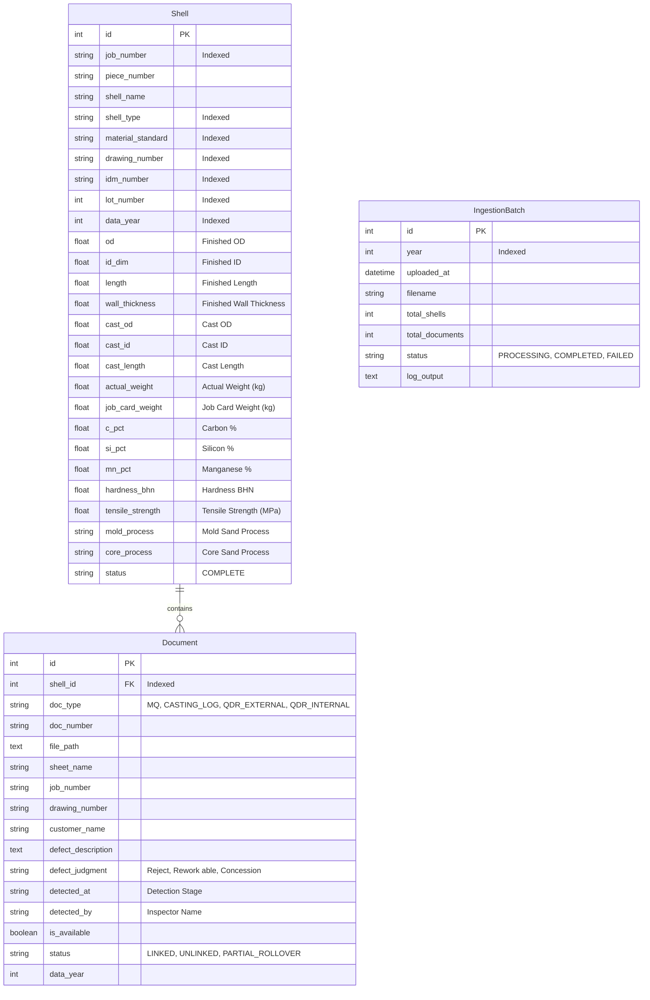

# QADRI GROUP — Industrial Shell Data Retrieval, Casting Envelope & Quality Intelligence Portal

<div align="center">
  
  <h3>QADRI GROUP OF COMPANIES</h3>
  <p><strong>Foundry Shell & Casting Quality Intelligence Platform</strong></p>
  <p>
    <code>FastAPI 0.115+</code> • <code>SQLAlchemy 2.0+</code> • <code>SQLite</code> • <code>Vanilla JS (ES6+)</code> • <code>CSS3 Design System</code> • <code>Pandas / OpenPyXL</code>
  </p>
</div>

---

## 🌟 Overview & Core Capabilities

The **Qadri Group Industrial Shell Portal** is a production foundry engineering platform engineered for heavy mill roller casting stock evaluation, machining envelope yield optimization, quality defect Pareto analytics, multi-year historical dataset ingestion, and selective technical document retrieval.

```
+----------------------------------------------------------------------------------------------------+
|                                    QADRI GROUP FOUNDRY PORTAL                                      |
+--------------------------+--------------------------+-----------------------+----------------------+
|   Dimensional Search     |    Job Dossier Center    |   Quality Analytics   | Ingestion Manager    |
| - Machining Stock Env.   | - Selective File DL (ZIP)| - Pareto Defect Dist. | - ZIP Upload (2023+) |
| - 2D SVG Cross-Section   | - Metallurgy Sub-Sheets  | - Monthly Tonnage     | - Heuristic 3-Pass   |
| - Volumetric Yield (%)   | - Casting & QDAR Logs    | - Alloy Scrap Matrix  | - Live Terminal Log  |
+--------------------------+--------------------------+-----------------------+----------------------+
```

---

### 1. 🔍 Dimensional Search & Machining Stock Envelope Calculator
- **Multi-Mode Dimensional Proximity Search**:
  - **Finish Size Mode**: Match against target finished (machined) blueprint dimensions ($\text{OD}$, $\text{ID}$, $\text{Length}$, $\text{Wall Thickness}$) with customizable tolerance margins ($\pm 0\text{--}100\,\text{mm}$).
  - **Casted Size Mode**: Match directly against raw as-cast stock dimensions.
  - **Auto Match Mode**: Concurrently evaluates both finished targets and raw stock.
- **Machining Stock Envelope & Yield Calculator**:
  Determines whether a raw casting stock envelope physically contains the required finish geometry given specified radial allowances and end-facing cuts:
  $$\text{OD}_{\text{cast}} \ge \text{OD}_{\text{target}} + 2 \times \text{OD}_{\text{allowance}}$$
  $$\text{ID}_{\text{cast}} \le \text{ID}_{\text{target}} - 2 \times \text{ID}_{\text{allowance}}$$
  $$\text{Length}_{\text{cast}} \ge \text{Length}_{\text{target}} + 2 \times \text{Face}_{\text{allowance}}$$
- **Volumetric Material Utilization Yield**:
  Computes the exact volumetric casting yield percentage ($\%$):
  $$\text{Yield } (\%) = \frac{(\text{Target OD}^2 - \text{Target ID}^2) \times \text{Target Length}}{(\text{Cast OD}^2 - \text{Cast ID}^2) \times \text{Cast Length}} \times 100$$
- **Signed Delta Badges**: Real-time indicators showing exact dimension differences (e.g. $\Delta +2.0\,\text{mm}$, $\Delta -1.5\,\text{mm}$, $\Delta \text{WT}$).
- **Real-Time 2D SVG Cross-Section Visualizer**: Interactive concentric blueprint rendering depicting as-cast raw stock, finished machined boundaries, and inner bore voids.
- **CSV Data Export**: 1-click export of filtered query results to CSV.

---

### 2. 📦 Job Dossier Center & Selective Document Retrieval (Single / ZIP)
- **Direct Job Lookup**: Instant search by Job Number (e.g. `SE24-BSCM-0025`, `SE23-`), Drawing Number, IDM code, or Customer Name.
- **Selective File Checklists**: Every matched shell displays all linked source files:
  - 📊 **M&Q Technical Workbooks** (`.xls` / `.xlsx` with per-shell metallurgy sub-sheets: C, Si, Mn, P, S, Cr, Ni, Mo %, BHN hardness, tensile/yield strengths)
  - 🔥 **Actual Casting Log Records** (shifter weights, date, mold/core sand processes: Alpha Set, Dolomite)
  - 🛡️ **External QDAR Defect Reports** (QA inspector tickets, customer complaints, detection stages)
  - ⚙️ **Internal QDAR Defect Reports** (shop floor inspection, non-conformance, and rework tracking)
  - 📄 **Auto-Generated Technical Dossier Summary** (`.txt`)
- **Flexible Downloads & Launch**:
  - Download individual files directly with the highlighted Job Number prefix.
  - Select any combination of checkboxes and download as a clean, standardized ZIP bundle (e.g. `[JOB_SE24-BSCM-0025]_Selected_Files.zip`).
  - Native local file launcher (`os.startfile`) for shop-floor workstations.

---

### 3. 📊 Quality Intelligence & Defect Analytics
- **Pareto Defect Distribution**: Visualizes defect frequency and cumulative impact $\%$ based on the $80/20$ Pareto principle across 8 foundry defect classes:
  1. *Blow Holes / Gas Porosity*
  2. *Sand Inclusions*
  3. *Shrinkage Cavity / Depression*
  4. *Slag Inclusions*
  5. *Dimensional Variance*
  6. *Cracks / Tears*
  7. *Machining Shift / Setup*
  8. *Collar / Face Defects*
- **Monthly Casting Volume & Tonnage**: Tracks manufactured shell counts and shifting tonnage across monthly production cycles.
- **Alloy Grade Scrap & Rework Matrix**: Evaluates rejection and rework rates categorized by metallurgical alloy specification (e.g. `QAST-ALLOY 2.0`, `QAST-ALLOY 2.1`, `C.I Mill Roller 2017`).
- **Foundry Lot Quality Heatmap**: Color-coded density matrix across manufacturing lots (Lot #1 through Lot #28+).
- **Molding & Core Process Distribution**: Process breakdown for Alpha Set, Dolomite, and custom riser setups.

---

### 4. 🗄️ Multi-Year Ingestion Manager & Terminal Worker
- **Web-Based ZIP Upload**: Drag-and-drop full-year archives (`2023.zip`, `2024.zip`, `2025.zip`, `2026.zip`).
- **Auto-Discovery ETL Pipeline**: Automatically resolves nested directory structures (`M&Q Data`, `QDARS`, `Actual Casting Log`), cleans and normalizes records, and executes heuristic 3-pass linking.
- **3-Pass Heuristic Linker**:
  - *Pass 1*: Canonical 3-part base job match (e.g. `SE24-BSCM-0025`).
  - *Pass 2*: Regex & alphanumeric token substrings across composite job identifiers.
  - *Pass 3*: Normalized drawing number fallback linking.
- **Live Terminal Console**: Real-time streamed progress, record counts, and error tracking.

---

## 🚀 How to Run the Portal & Make It Accessible

### 1. Prerequisites
- Python 3.10+ (Tested on Python 3.11, 3.12, 3.14)
- Virtual environment with required dependencies

### 2. Activate Virtual Environment & Install Dependencies
Open **PowerShell** or **Command Prompt** in the project directory:

```powershell
# Navigate to the portal directory
cd "d:\ML\Qadri ML project\industrial_shell_portal"

# Activate the virtual environment
..\venv\Scripts\Activate.ps1

# Install requirements (if needed)
pip install -r requirements.txt
```

---

### 3. Launching the Local Server

#### Option A: Run on Localhost (Only accessible on your computer)
```powershell
uvicorn backend.main:app --host 127.0.0.1 --port 8000 --reload
```
Open your browser and visit: **`http://localhost:8000`**

#### Option B: Make Accessible Across Local Network (Wi-Fi / LAN / Foundry Devices)
To access the portal from other computers, laptops, tablets, or mobile phones on the same Wi-Fi / office network:

```powershell
uvicorn backend.main:app --host 0.0.0.0 --port 8000
```

1. Find your machine's Local IP Address:
   ```powershell
   ipconfig
   # Look for "IPv4 Address", e.g. 192.168.1.50 or 10.0.0.15
   ```
2. Open any browser on any device connected to the same network and navigate to:
   **`http://YOUR_LOCAL_IP:8000`** (e.g. `http://192.168.1.50:8000`)

---

## 🌐 Web Application Pages & Routes

The portal is organized into dedicated multi-page views accessible from the top navigation bar:

| Route / URL | Page Description |
| :--- | :--- |
| **`/`** or **`/search`** | **Shell Search & Machining Stock Envelope Calculator** (2D SVG cross-section, dimensional search, tolerance slider, selective download modal) |
| **`/job-lookup`** or **`/dossier`** | **Job Dossier & Document Download Center** (direct Job Number lookup, full specs, file checklist, 1-click single/ZIP download) |
| **`/quality`** or **`/analytics`** | **Foundry Quality & Defect Intelligence** (Pareto chart, monthly tonnage, alloy scrap rates, lot quality heatmap) |
| **`/ingestion`** or **`/upload-manager`** | **Archive Ingestion & Year Manager** (archive drag-and-drop upload, live terminal streamer, past batch history) |
| **`/docs`** | **Interactive OpenAPI / Swagger Documentation** |
| **`/health`** | **Health Check & Service Status** |

---

## 🛠️ CLI Batch Ingestion Commands

If you prefer to run data ingestion directly from the command line:

```powershell
# Ingest and seed full dataset
python -m etl.seed_db

# Ingest specific year with custom directories
python -m etl.import_batch --year 2023 --mq-dir "data/raw/2023/M&Q 2023 Data" --qdar-dir "data/raw/2023/QDARS 2023"
```

---

## 📂 Project Architecture

```
industrial_shell_portal/
│
├── backend/
│   ├── main.py                  # FastAPI app entry point & multi-page routers
│   ├── config.py                # Central path and database configuration
│   ├── routes/
│   │   ├── search.py            # Dimensional search & CSV export API
│   │   ├── documents.py         # File inspection, selective ZIP & download API
│   │   ├── analytics.py         # Pareto, alloy scrap, and lot heatmap API
│   │   └── upload.py            # Archive ZIP upload & background ETL worker
│   └── services/
│       ├── matcher.py           # Proximity search, deltas & stock envelope engine
│       └── normalizer.py        # Job numbers, tokenizers & alphanumeric cleaners
│
├── database/
│   ├── db.py                    # SQLAlchemy SQLite engine & session setup
│   └── models.py                # Shell, Document, and IngestionBatch ORM models
│
├── etl/
│   ├── parse_mq_files.py        # M&Q workbook & metallurgy parser (with auto-directory discovery)
│   ├── clean_casting_log.py     # Actual Casting Log parser & weight tracker
│   ├── parse_qad_files.py       # QDAR defect ticket parser (External & Internal)
│   ├── seed_db.py               # 3-Pass heuristic matcher & database seeder
│   └── import_batch.py          # Standalone CLI batch importer
│
├── frontend/
│   ├── index.html               # Main Shell Search & Stock Calculator page
│   ├── job_lookup.html          # Job Dossier & Document Download Center page
│   ├── quality.html             # Quality Intelligence & Defect Analytics page
│   ├── ingestion.html           # Archive Ingestion & Live Terminal page
│   ├── qadri_logo.svg           # Official Qadri Group vector emblem
│   ├── style.css                # Qadri Group executive corporate theme (Dark/Light)
│   └── app.js                   # Application state, 2D SVG canvas & download modal logic
│
├── data/
│   ├── industrial_shells.db     # SQLite database (1,460+ shells, 2,380+ linked documents)
│   ├── raw/                     # Uploaded and extracted archives partitioned by year
│   └── processed/               # Intermediate ETL JSON mappings
│
├── .gitignore                   # Complete GitHub ignore rules (binaries, databases, venv)
└── requirements.txt             # Project dependencies
```

---

## 🗄️ Database Entity-Relationship Model



---

## 🧪 Testing & Validation

To verify all system endpoints and API responses:

```powershell
python -c "from fastapi.testclient import TestClient; from backend.main import app; c = TestClient(app); print('Status:', c.get('/health').json())"
```

Expected Response:
```json
{"status": "ok", "service": "Qadri Group — Industrial Shell Portal v3.5"}
```

---

## 🛡️ License & Proprietary Rights

**Confidential & Proprietary.**  
© 2026 **Qadri Group of Companies**. All rights reserved.  
Unauthorized distribution, copying, or reverse engineering of this software platform is strictly prohibited.
