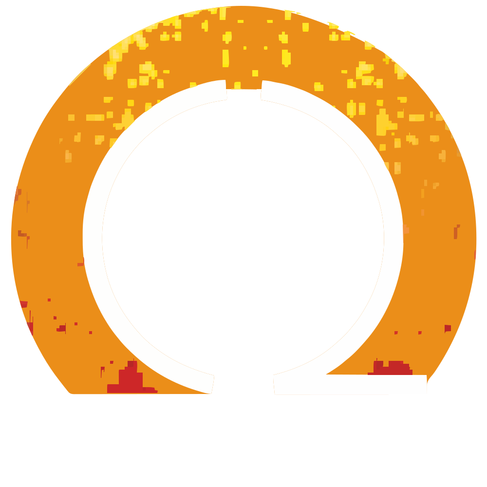

<p align="center">
  
</p>

<h1 align="center">Qadri Group — Industrial Shell Portal</h1>

<p align="center">
  <strong>Foundry Shell Data Retrieval, Casting Stock Envelope Calculator & Quality Intelligence Platform</strong>
</p>

<p align="center">
  
  
  
  
  
</p>

---

## Table of Contents

- [Overview](#overview)
- [Key Capabilities](#key-capabilities)
- [Architecture](#architecture)
- [Project Structure](#project-structure)
- [Tech Stack](#tech-stack)
- [Prerequisites](#prerequisites)
- [Installation & Setup](#installation--setup)
- [Running the Portal](#running-the-portal)
- [Data Ingestion](#data-ingestion)
- [Portal Pages & Features](#portal-pages--features)
- [API Reference](#api-reference)
- [Database Schema](#database-schema)
- [ETL Pipeline](#etl-pipeline)
- [Configuration](#configuration)
- [Deployment](#deployment)
- [Contributing](#contributing)
- [License](#license)

---

## Overview

The **Industrial Shell Portal** is a full-stack web application built for **Qadri Group** to manage, search, analyze, and retrieve foundry-manufactured industrial mill roller shells. It consolidates multi-year manufacturing data from M&Q workbooks, Actual Casting Logs, and QDAR quality reports into a single, searchable SQLite database — served through a FastAPI backend and a premium, dark-themed frontend UI.

This portal replaces manual Excel-based lookups with intelligent dimensional search, machining stock envelope calculations, defect analytics, and one-click document downloads — enabling foundry engineers, quality teams, and production managers to make data-driven decisions in seconds.

---

## Key Capabilities

### 🔍 Dimensional Search Engine
- **Multi-mode dimensional search**: Search shells by **Finish** (machined target), **Casted** (as-cast raw stock), or **Both** dimensions simultaneously.
- **Configurable tolerance** (±mm) for OD, ID, Length, and Wall Thickness.
- **Confidence scoring**: Each result is ranked by match confidence (0–100%) based on relative dimensional deviation.
- **Signed delta display**: Shows ΔOD, ΔID, ΔLength, ΔWT with `+`/`−` formatted strings for instant visual comparison.

### 📐 Machining Stock Envelope & Yield Calculator
- Evaluates whether a raw casting's as-cast stock **geometrically encloses** a target machined part with configurable machining allowances (OD, ID, Facing per side).
- Computes **stock removal cuts** (mm per side) for OD, ID, and Face.
- Computes **Volumetric Machining Yield %**:
  ```
  Yield % = [(Target OD² − Target ID²) × Target L] / [(Cast OD² − Cast ID²) × Cast L] × 100
  ```
- Ranks candidates by highest yield percentage.

### 📊 Foundry Quality & Defect Intelligence Analytics
- **Pareto Defect Distribution**: Regex-driven categorization of defect descriptions into Blow Holes, Sand Inclusions, Shrinkage, Slag, Dimensional Variance, Cracks, Machining Shift, Collar Defects, etc.
- **Alloy Grade Scrap & Rework Rates**: Defect density and rejection rates broken down by material standard (alloy grade).
- **Lot Quality Heatmap**: Defect density per foundry lot with severity classification (Clean / Low / Medium / High).
- **Casting Intelligence KPIs**: Total actual tonnage, job tonnage, net weight variance, overweight/underweight shell counts.
- **Monthly Casting Throughput**: Shell count and tonnage per calendar month.
- **Process Breakdown**: Mold process, core process, and riser technology distribution.
- **Defect Judgment Distribution**: Reject / Rework able / Concession counts.

### 📁 Job Number Dossier & Document Download Center
- **Job Number Lookup**: Instantly retrieve all engineering documents linked to a specific job number.
- **Foundry Intelligence Dossier**: Auto-generated plaintext dossier containing identification, dimensional matrix, casting weight & tracking, chemical composition, mechanical properties, and linked document inventory.
- **Selective File Download**: Checkbox-based selection of individual documents (M&Q plans, Casting Logs, QDR reports) for single-file or ZIP bundle download.
- **Full Engineering Bundle**: One-click ZIP download of all documents with `[JOB_XXX]` prefixed filenames for easy identification.
- **Local File Launch**: Open documents directly in the default OS application (Excel, PDF reader).

### 📤 Multi-Year Archive Ingestion Manager
- **Web-based ZIP upload**: Upload full-year archive ZIP files containing M&Q workbooks, Casting Logs, and QDAR quality reports.
- **Background ETL Processing**: Asynchronous extraction, parsing, and database seeding with real-time terminal log streaming.
- **Smart Data Root Detection**: BFS-based auto-detection of actual data directories inside nested ZIP structures.
- **Batch History Dashboard**: View all past ingestion batches with status (Processing / Completed / Failed), shell/document counts, and timestamps.
- **Multi-year support**: Ingest and query data across manufacturing years (2022–2025+).

### 🔄 Advanced Filters & Export
- Filter by: Material Standard, Shell Type, Lot Number, Data Year, Job Number (partial match), Weight Range, Wall Thickness.
- **Global keyword search** across Job Number, Drawing Number, IDM Number, Shell Name, Material Standard, and Piece Number.
- **CSV Export**: Export filtered search results as comprehensive CSV files with all dimensional, metallurgical, and casting data.
- **Sortable results**: Sort by Confidence, OD, ID, Length, Wall Thickness, Weight, Yield %, or Lot Number.

### 🎨 Premium UI & UX
- **Dark-themed glassmorphism design** with animated background grid and glow effects.
- **Light/Dark mode toggle** with persistent preference.
- **Real-time 2D SVG cross-section visualizer** for shell dimension comparison.
- **Responsive multi-page navigation**: Shell Search, Job Dossier, Quality Intelligence, Archive Ingestion.
- **JetBrains Mono** monospace font for data tables, **Inter** for UI typography.

---

## Architecture

```
┌──────────────────────────────────────────────────────────────┐
│                     Browser (Frontend)                       │
│  index.html │ job_lookup.html │ quality.html │ ingestion.html│
│          app.js  +  style.css  +  qadri_logo.svg            │
└──────────────────────┬───────────────────────────────────────┘
                       │  HTTP / REST API
┌──────────────────────▼───────────────────────────────────────┐
│                 FastAPI Backend (Python)                      │
│  main.py ─── CORS ─── Static File Mount ─── HTML Routes      │
│                                                              │
│  Routes:                    Services:                         │
│  ├── /api/search            ├── matcher.py (Search Engine)   │
│  ├── /api/filters           └── normalizer.py (Job ID Norm)  │
│  ├── /api/export                                             │
│  ├── /api/stats                                              │
│  ├── /api/analytics/summary                                  │
│  ├── /api/documents/*                                        │
│  └── /api/upload/*                                           │
└──────────────────────┬───────────────────────────────────────┘
                       │  SQLAlchemy ORM
┌──────────────────────▼───────────────────────────────────────┐
│              SQLite Database (industrial_shells.db)           │
│  Tables: shells │ documents │ ingestion_batches              │
└──────────────────────▲───────────────────────────────────────┘
                       │  Batch ETL
┌──────────────────────┴───────────────────────────────────────┐
│                    ETL Pipeline                               │
│  parse_mq_files.py  → M&Q workbook extraction                │
│  clean_casting_log.py → Actual Casting Log parsing           │
│  parse_qad_files.py  → QDAR quality report extraction        │
│  import_batch.py     → Batch import coordination             │
│  seed_db.py          → 3-Pass heuristic matching & seeding   │
└──────────────────────────────────────────────────────────────┘
```

---

## Project Structure

```
industrial_shell_portal/
├── backend/
│   ├── __init__.py
│   ├── config.py                 # Central path & server settings
│   ├── main.py                   # FastAPI app entry point
│   ├── routes/
│   │   ├── __init__.py
│   │   ├── search.py             # Dimensional search & CSV export API
│   │   ├── documents.py          # Document download, bundle, launch API
│   │   ├── analytics.py          # Quality & defect intelligence API
│   │   └── upload.py             # ZIP archive upload & background ETL API
│   └── services/
│       ├── __init__.py
│       ├── matcher.py            # Search engine, confidence scoring, envelope calc
│       └── normalizer.py         # Job/piece/drawing number normalization
│
├── database/
│   ├── __init__.py
│   ├── db.py                     # SQLAlchemy engine, session, init_db()
│   └── models.py                 # ORM models: Shell, Document, IngestionBatch
│
├── etl/
│   ├── __init__.py
│   ├── parse_mq_files.py         # M&Q workbook parser (xlrd)
│   ├── clean_casting_log.py      # Casting Log parser (openpyxl)
│   ├── parse_qad_files.py        # QDAR quality report parser
│   ├── import_batch.py           # Batch import coordinator
│   └── seed_db.py                # Database seeder with 3-pass heuristic matcher
│
├── frontend/
│   ├── index.html                # Shell Search & Casting Calculator page
│   ├── job_lookup.html           # Job Number Dossier & Document Center page
│   ├── quality.html              # Foundry Quality & Defect Analytics page
│   ├── ingestion.html            # Multi-Year Archive Ingestion Manager page
│   ├── app.js                    # Frontend application logic
│   ├── style.css                 # Global stylesheet (dark theme, glassmorphism)
│   └── qadri_logo.svg            # Company logo
│
├── data/                         # Runtime data (auto-created, gitignored)
│   ├── industrial_shells.db      # SQLite database
│   ├── raw/                      # Uploaded ZIP archives & extracted files
│   └── processed/                # Intermediate JSON artifacts
│
├── requirements.txt              # Python dependencies
├── .gitignore                    # Comprehensive gitignore rules
└── README.md                     # This file
```

---

## Tech Stack

| Layer         | Technology                                           |
|---------------|------------------------------------------------------|
| **Backend**   | Python 3.11+, FastAPI 0.115+, Uvicorn (ASGI)        |
| **ORM**       | SQLAlchemy 2.0+ with declarative ORM                 |
| **Database**  | SQLite 3 (file-based, zero-config)                   |
| **ETL**       | pandas, openpyxl, xlrd                                |
| **Frontend**  | Vanilla HTML5, CSS3, JavaScript (ES6+)               |
| **Typography**| Inter (UI), JetBrains Mono (data/code)               |
| **Async I/O** | aiofiles, python-multipart (file uploads)            |
| **Validation**| Pydantic 2.9+                                        |

---

## Prerequisites

- **Python 3.11** or higher
- **pip** (Python package manager)
- **Git** (for cloning)
- A modern web browser (Chrome, Firefox, Edge)

---

## Installation & Setup

### 1. Clone the Repository

```bash
git clone https://github.com/<your-username>/industrial_shell_portal.git
cd industrial_shell_portal
```

### 2. Create a Virtual Environment

```bash
# Windows
python -m venv venv
venv\Scripts\activate

# macOS / Linux
python3 -m venv venv
source venv/bin/activate
```

### 3. Install Dependencies

```bash
pip install -r requirements.txt
```

The `requirements.txt` includes:

```
fastapi>=0.115.0
uvicorn[standard]>=0.30.0
sqlalchemy>=2.0.35
openpyxl>=3.1.5
xlrd>=2.0.1
pandas>=2.2.0
pydantic>=2.9.0
aiofiles>=24.1.0
python-multipart>=0.0.12
```

### 4. Initialize the Database

The database is **auto-created** on first server startup. No manual migration is needed — `init_db()` is called during FastAPI's `on_startup` event, which creates all tables from the SQLAlchemy models.

---

## Running the Portal

### Development Server

```bash
# From the project root (industrial_shell_portal/)
uvicorn backend.main:app --host 0.0.0.0 --port 8000 --reload
```

The portal will be available at: **http://localhost:8000**

### Available Routes

| URL                      | Page                                        |
|--------------------------|---------------------------------------------|
| `http://localhost:8000/`  | Shell Search & Casting Stock Calculator     |
| `http://localhost:8000/job-lookup` | Job Number Dossier & Document Center |
| `http://localhost:8000/quality`    | Foundry Quality & Defect Analytics   |
| `http://localhost:8000/ingestion`  | Multi-Year Archive Ingestion Manager |
| `http://localhost:8000/docs`       | Interactive Swagger API Documentation|
| `http://localhost:8000/redoc`      | ReDoc API Documentation              |
| `http://localhost:8000/health`     | Health Check Endpoint                |

---

## Data Ingestion

The portal ships with an **empty database** — you must ingest your foundry data before searching. There are two ways to populate the database:

### Option A: Web-Based Upload (Recommended)

1. Navigate to **http://localhost:8000/ingestion** (Archive Ingestion page).
2. Select the target manufacturing **year** (e.g., 2024, 2025).
3. Upload a **ZIP archive** containing your foundry data:
   ```
   your_archive.zip
   └── M& Q 2025 Data/
   │   ├── Lot 1/
   │   │   ├── M&Q data.xls
   │   │   └── Shell#1.xls, Shell#2.xls, ...
   │   ├── Lot 2/
   │   │   └── ...
   │   └── ...
   ├── QDARS 2025/
   │   ├── QDAR-001.xlsx
   │   ├── QDAR-002.xlsx
   │   └── ...
   └── Actual Casting Log 2025.xlsx
   ```
4. The ETL pipeline runs in the background — monitor progress via the **live terminal log** on the ingestion page.

### Option B: Direct ETL Script Execution

If your raw data is on the local filesystem:

```bash
# 1. Parse M&Q workbooks
python -m etl.parse_mq_files

# 2. Parse Casting Log
python -m etl.clean_casting_log

# 3. Parse QDAR quality reports
python -m etl.parse_qad_files

# 4. Seed the database (merges and links all records)
python -m etl.seed_db
```

> **Note:** Update the raw data directory paths in `backend/config.py` and `etl/*.py` if your data files are in a different location.

---

## Portal Pages & Features

### 1. Shell Search & Casting Stock Calculator (`/`)

The primary interface for dimensional search and machining envelope evaluation.

- Enter target dimensions (OD, ID, Length) with configurable tolerance.
- Toggle between **Finish**, **Casted**, or **Both** dimension modes.
- Enable **Machining Stock Envelope Mode** to evaluate raw casting stock viability with OD/ID/Facing allowances.
- View results in a detailed data table with:
  - Dimensional deltas (ΔOD, ΔID, ΔL, ΔWT)
  - Confidence score and matched mode
  - As-cast vs. finish dimension comparison
  - Machining yield %, stock removal cuts, envelope status
  - Metallurgical composition (C, Si, Mn, P, S, Cr, Ni, Mo)
  - Mechanical properties (Hardness BHN, Tensile Strength)
  - Linked document counts and defect badges
- **Export** filtered results to CSV.

### 2. Job Number Dossier & Document Center (`/job-lookup`)

- Enter a job number to instantly retrieve all linked documents.
- View a comprehensive file inventory with:
  - Document type (M&Q, Casting Log, QDR External, QDR Internal)
  - File availability status (on-disk / archived / rollover)
  - File size and sheet name
  - Defect judgment and description (for QDR documents)
- **Download** individual files or a complete engineering ZIP bundle.
- **Auto-generated Intelligence Dossier** (plaintext) included in every bundle.

### 3. Foundry Quality & Defect Intelligence (`/quality`)

- **KPI Summary Cards**: Total shells, total documents, total QDARs, overall defect rate %.
- **Pareto Chart**: Defect categories ranked by frequency with cumulative percentage.
- **Alloy Quality Table**: Per-grade total cast, defect count, defect shells, rejection rate %, rework count.
- **Lot Heatmap**: Defect density per lot with color-coded severity (clean → low → medium → high).
- **Casting Analytics**: Monthly throughput (count & tonnage), mold/core process breakdown, riser technology distribution.
- **Weight Variance KPIs**: Total actual vs. job tonnage, net variance, average weight difference, overweight/underweight counts.

### 4. Multi-Year Archive Ingestion Manager (`/ingestion`)

- Upload `.zip` archives for any manufacturing year.
- Monitor background ETL pipeline via **real-time terminal logs**.
- View **batch history** with status indicators and record counts.
- Supports re-ingestion and multi-year data accumulation.

---

## API Reference

All API endpoints are prefixed with `/api` and documented via interactive Swagger UI at `/docs`.

### Search API (`/api`)

| Method | Endpoint        | Description                                |
|--------|-----------------|--------------------------------------------|
| GET    | `/api/search`   | Dimensional search with filters & envelope |
| GET    | `/api/filters`  | Distinct dropdown filter options            |
| GET    | `/api/export`   | Export filtered results as CSV              |
| GET    | `/api/stats`    | Database summary statistics                 |

#### Search Parameters

| Parameter          | Type    | Default  | Description                                    |
|--------------------|---------|----------|------------------------------------------------|
| `od`               | float   | —        | Target Outer Diameter (mm)                     |
| `id`               | float   | —        | Target Inner Diameter (mm)                     |
| `length`           | float   | —        | Target Length (mm)                              |
| `tolerance`        | float   | 5.0      | Tolerance ±mm (0–100)                          |
| `dimension_mode`   | string  | "finish" | `finish`, `casted`, or `both`                  |
| `machining_mode`   | bool    | false    | Enable Machining Stock Envelope mode           |
| `od_allowance`     | float   | 5.0      | OD radial machining allowance per side (mm)    |
| `id_allowance`     | float   | 5.0      | ID radial machining allowance per side (mm)    |
| `face_allowance`   | float   | 10.0     | Facing allowance per end (mm)                  |
| `wall_thickness`   | float   | —        | Nominal Wall Thickness (mm)                    |
| `wt_tolerance`     | float   | 2.0      | Wall thickness tolerance ±mm                   |
| `min_weight`       | float   | —        | Minimum weight filter (kg)                     |
| `max_weight`       | float   | —        | Maximum weight filter (kg)                     |
| `material_standard`| string  | —        | Material standard / alloy grade filter         |
| `shell_type`       | string  | —        | Shell type filter                               |
| `job_number`       | string  | —        | Job number filter (partial match)              |
| `query`            | string  | —        | Global keyword search                           |
| `lot_number`       | int     | —        | Lot number filter                               |
| `data_year`        | int     | —        | Data year filter                                |
| `sort_by`          | string  | "confidence" | `confidence`, `od`, `id`, `length`, `wall_thickness`, `weight`, `yield`, `lot` |
| `sort_order`       | string  | "desc"   | `asc` or `desc`                                |
| `limit`            | int     | 100      | Max results (1–500)                            |

### Analytics API (`/api/analytics`)

| Method | Endpoint                | Description                                |
|--------|-------------------------|--------------------------------------------|
| GET    | `/api/analytics/summary`| Complete quality & defect analytics payload |

### Documents API (`/api/documents`)

| Method | Endpoint                                 | Description                              |
|--------|------------------------------------------|------------------------------------------|
| GET    | `/api/documents/shell/{id}/files`        | List all files linked to a shell         |
| GET    | `/api/documents/job/{job}/files`         | List all files linked to a job number    |
| GET    | `/api/documents/{id}/info`               | Full document metadata & defect details  |
| GET    | `/api/documents/{id}/download`           | Download original document file          |
| GET    | `/api/documents/{id}/launch`             | Open document in OS default app          |
| POST   | `/api/documents/download-selected`       | Download selected files (single/ZIP)     |
| GET    | `/api/documents/job/{job}/download-bundle`| Download full job engineering ZIP bundle |

### Upload API (`/api/upload`)

| Method | Endpoint                      | Description                              |
|--------|-------------------------------|------------------------------------------|
| POST   | `/api/upload/year-data`       | Upload ZIP archive & start ETL           |
| GET    | `/api/upload/status/{batch_id}`| Check ingestion batch status & logs     |
| GET    | `/api/upload/history`         | List all past ingestion batches          |

---

## Database Schema

The portal uses three SQLAlchemy ORM models mapped to SQLite tables:

### `shells` Table

Stores manufactured casting shells with dimensional, metallurgical, and mechanical properties.

| Column              | Type         | Description                                |
|---------------------|--------------|--------------------------------------------|
| `id`                | Integer (PK) | Auto-increment primary key                 |
| `job_number`        | String(100)  | Job identifier (indexed)                   |
| `piece_number`      | String(50)   | Piece number within job                    |
| `shell_name`        | String(255)  | Shell description                          |
| `shell_type`        | String(100)  | Shell type classification                  |
| `material_standard` | String(100)  | Alloy grade / material standard            |
| `drawing_number`    | String(100)  | Engineering drawing reference              |
| `idm_number`        | String(100)  | IDM reference number                       |
| `lot_number`        | Integer      | Foundry lot number                         |
| `data_year`         | Integer      | Manufacturing year                         |
| `od`, `id_dim`, `length`, `wall_thickness` | Float | Finish (machined) dimensions (mm) |
| `cast_od`, `cast_id`, `cast_length`, `cast_wall_thickness` | Float | As-cast dimensions (mm) |
| `weight`, `actual_weight`, `job_card_weight`, `calculated_weight`, `weight_diff` | Float | Weight tracking (kg) |
| `c_pct`, `si_pct`, `mn_pct`, `p_pct`, `s_pct`, `cr_pct`, `ni_pct`, `mo_pct` | Float | Chemical composition (%) |
| `hardness_bhn`, `tensile_strength`, `yield_strength`, `elongation_pct` | Float | Mechanical properties |
| `mold_process`, `core_process`, `technology`, `riser_pct` | String/Float | Foundry process metadata |
| `cast_date`, `month`, `heat_number`, `status` | String | Casting operation tracking |

### `documents` Table

Stores linked engineering documents with quality & defect intelligence.

| Column               | Type         | Description                               |
|----------------------|--------------|--------------------------------------------|
| `id`                 | Integer (PK) | Auto-increment primary key                |
| `shell_id`           | Integer (FK) | Foreign key to `shells.id`                |
| `doc_type`           | String(20)   | `MQ`, `CASTING_LOG`, `QDR_EXTERNAL`, `QDR_INTERNAL`, `QAD` |
| `doc_number`         | String(100)  | Document reference number                 |
| `file_path`          | Text         | Absolute path to source file on disk      |
| `job_number`         | String(100)  | Associated job number                     |
| `defect_description` | Text         | Defect description (QDR documents)        |
| `defect_judgment`    | String(100)  | `Reject`, `Rework able`, `Concession`     |
| `detected_at`        | String(255)  | Detection stage / location                |
| `status`             | String(50)   | `LINKED`, `UNLINKED`, `PARTIAL_ROLLOVER`  |
| `data_year`          | Integer      | Manufacturing year                         |

### `ingestion_batches` Table

Tracks archive upload and ETL execution history.

| Column           | Type         | Description                                |
|------------------|--------------|--------------------------------------------|
| `id`             | Integer (PK) | Auto-increment primary key                 |
| `year`           | Integer      | Target manufacturing year                  |
| `filename`       | String(255)  | Uploaded archive filename                  |
| `uploaded_at`    | DateTime     | Upload timestamp                            |
| `total_shells`   | Integer      | Count of shells processed                  |
| `total_documents`| Integer      | Count of documents processed               |
| `status`         | String(50)   | `PROCESSING`, `COMPLETED`, `FAILED`        |
| `log_output`     | Text         | Full terminal log from ETL execution       |

---

## ETL Pipeline

The ETL (Extract, Transform, Load) pipeline processes raw foundry workbooks into structured database records.

### Pipeline Stages

1. **`parse_mq_files.py`** — Parses M&Q workbooks (`.xls` format via `xlrd`):
   - Extracts dimensions, identifiers, and weights from the `M&Q data` master sheet.
   - Parses individual per-shell sub-sheets (`Shell#1`, `Shell#2`, etc.) for chemical composition (%C, %Si, %Mn, %P, %S, %Cr, %Ni, %Mo) and mechanical properties (Hardness BHN, Tensile Strength).
   - Provides standard metallurgical reference profiles for recognized alloy grades.

2. **`clean_casting_log.py`** — Parses the Actual Casting Log (`.xlsx` format via `openpyxl`):
   - High-speed streaming parser with automatic empty-row cutoff.
   - Extracts actual measured weight, allowable weight, calculated weight, and weight variance.
   - Extracts tooling, pattern, molding process, core process, riser %, simulation paths, and shaft fitting metadata.

3. **`parse_qad_files.py`** — Parses QDAR quality reports (`.xlsx` / `.xls` format):
   - Extracts QDAR number, date, customer, job number, part name, drawing number.
   - Extracts defect description, investigation remarks, defect judgment (Reject / Rework able / Concession).
   - Extracts detection stage, inspector name, and responsible department.
   - Auto-fallback between `openpyxl` and `xlrd` formats.

4. **`seed_db.py`** — Database seeder with 3-pass heuristic QDAR matcher:
   - **Pass 1**: Canonical 3-part base job match (e.g., `SE24-BSCM-0025`).
   - **Pass 2**: Regex & token substring matching across complex job strings.
   - **Pass 3**: Normalized drawing number fallback.
   - Merges M&Q records with Casting Log data (weight, dates, processes).
   - Retains unlinked QDAR records with `status='UNLINKED'` for manual review.

### Normalization Services

The `normalizer.py` service provides:
- **Job number normalization**: Strips whitespace, uppercases, removes `.0` float artifacts.
- **Base job extraction**: Extracts canonical 3-segment identifier (e.g., `SE24-BSCM-0025-1-1` → `SE24-BSCM-0025`).
- **Piece number normalization**: Standardizes separators (`01/01` → `1/1`, `02-04` → `2/4`).
- **Multi-number token extraction**: Handles joint numbers like `SE24-CAGS-0013 & 0014`.
- **Rollover detection**: Identifies jobs originating from earlier year batches.

---

## Configuration

All configuration lives in `backend/config.py`:

```python
PROJECT_ROOT = Path(__file__).resolve().parent.parent

# Data directories
DATA_DIR = PROJECT_ROOT / "data"
RAW_DATA_DIR = DATA_DIR / "raw"
PROCESSED_DATA_DIR = DATA_DIR / "processed"

# Database
DB_PATH = DATA_DIR / "industrial_shells.db"
DATABASE_URL = f"sqlite:///{DB_PATH}"

# Frontend
FRONTEND_DIR = PROJECT_ROOT / "frontend"

# Server settings
HOST = "0.0.0.0"
PORT = 8000
DEBUG = True  # Set to False in production
```

### CORS Configuration

- **Development** (`DEBUG = True`): All origins allowed (`*`).
- **Production** (`DEBUG = False`): Restricted to `localhost:8000` and `127.0.0.1:8000`. Add your production domain(s) in `backend/main.py`.

---

## Deployment

### Local Deployment

```bash
# Start production server
uvicorn backend.main:app --host 0.0.0.0 --port 8000
```

### Production Deployment (Linux Server)

1. **Clone and install** (follow [Installation & Setup](#installation--setup)).

2. **Set `DEBUG = False`** in `backend/config.py`.

3. **Add your production domain** to `ALLOWED_ORIGINS` in `backend/main.py`:
   ```python
   ALLOWED_ORIGINS = [
       "https://portal.yourcompany.com",
       "http://localhost:8000",
   ]
   ```

4. **Run with Gunicorn + Uvicorn workers** (recommended for production):
   ```bash
   pip install gunicorn
   gunicorn backend.main:app \
       --workers 4 \
       --worker-class uvicorn.workers.UvicornWorker \
       --bind 0.0.0.0:8000
   ```

5. **Reverse proxy with Nginx** (optional but recommended):
   ```nginx
   server {
       listen 80;
       server_name portal.yourcompany.com;

       location / {
           proxy_pass http://127.0.0.1:8000;
           proxy_set_header Host $host;
           proxy_set_header X-Real-IP $remote_addr;
           proxy_set_header X-Forwarded-For $proxy_add_x_forwarded_for;
           proxy_set_header X-Forwarded-Proto $scheme;
       }
   }
   ```

6. **Systemd service** (optional, for auto-start):
   ```ini
   [Unit]
   Description=Industrial Shell Portal
   After=network.target

   [Service]
   User=www-data
   WorkingDirectory=/opt/industrial_shell_portal
   ExecStart=/opt/industrial_shell_portal/venv/bin/gunicorn backend.main:app \
       --workers 4 --worker-class uvicorn.workers.UvicornWorker --bind 0.0.0.0:8000
   Restart=always

   [Install]
   WantedBy=multi-user.target
   ```

### Docker Deployment (Optional)

```dockerfile
FROM python:3.11-slim

WORKDIR /app
COPY requirements.txt .
RUN pip install --no-cache-dir -r requirements.txt

COPY . .
RUN mkdir -p data

EXPOSE 8000

CMD ["uvicorn", "backend.main:app", "--host", "0.0.0.0", "--port", "8000"]
```

```bash
docker build -t industrial-shell-portal .
docker run -d -p 8000:8000 -v $(pwd)/data:/app/data industrial-shell-portal
```

---

## Contributing

1. Fork the repository.
2. Create a feature branch: `git checkout -b feature/your-feature`.
3. Commit your changes: `git commit -m "Add your feature"`.
4. Push to the branch: `git push origin feature/your-feature`.
5. Open a Pull Request.

---

## License

This project is proprietary software developed for **Qadri Group**. All rights reserved.

---

<p align="center">
  <sub>Built with ⚙️ by <strong>Qadri Group Engineering</strong></sub>
</p>
